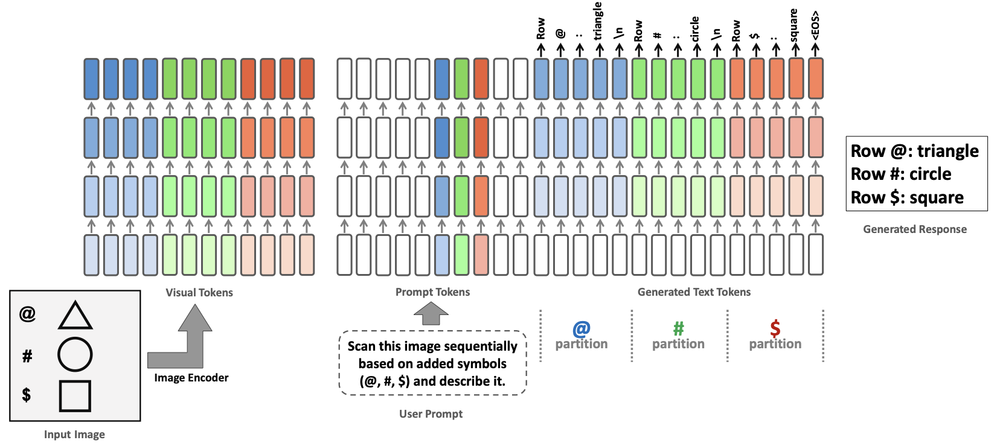
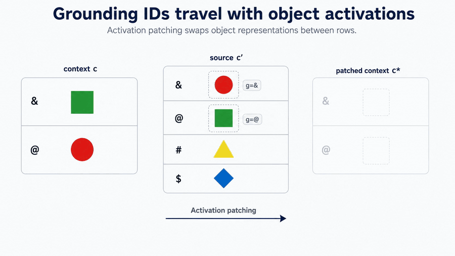
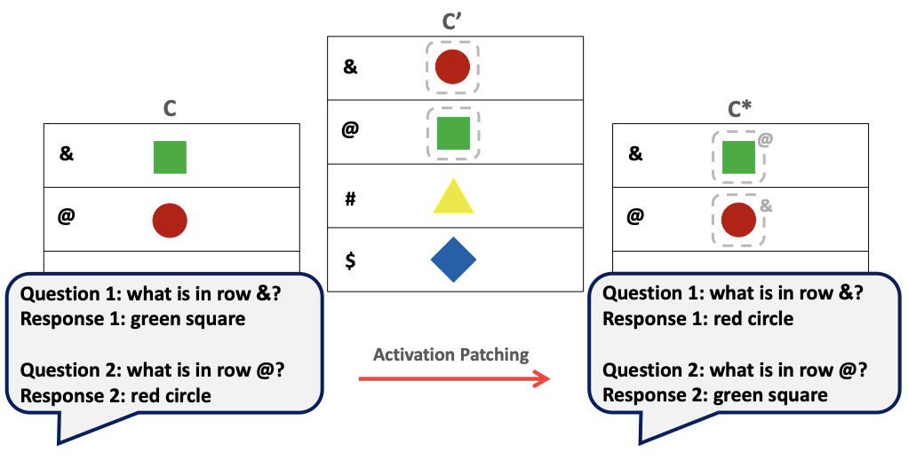
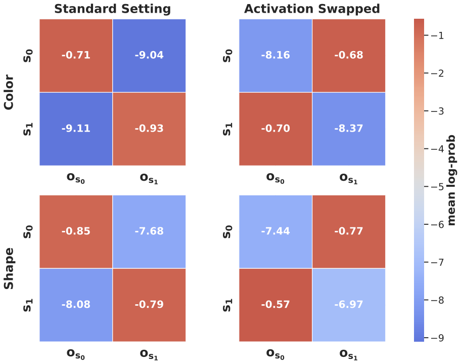

<h1 align="center">
Uncovering Grounding IDs:<br>
How External Cues Shape Multimodal Binding
</h1>

<p align="center">
  <strong>ICML 2026 &middot; Official Code Release</strong>
</p>

<p align="center">
  <a href="https://arxiv.org/abs/2509.24072">Paper</a> &middot;
  <a href="https://arxiv.org/abs/2509.24072">arXiv:2509.24072</a> &middot;
  <a href="LICENSE">MIT License</a>
</p>

<p align="center">
  <strong>Release:</strong> <code>v0.1</code> &middot;
  <strong>Status:</strong> initial code release
</p>

---

## Authors

<p align="center">
  Hosein Hasani<sup>*</sup> &middot; Amirmohammad Izadi<sup>*</sup> &middot; Fatemeh Askari<sup>*</sup> &middot; Mobin Bagherian<sup>*</sup> &middot; Sadegh Mohammadian &middot; Mohammad Izadi &middot; Mahdieh Soleymani Baghshah
  <br>
  Sharif University of Technology
  <br>
  <strong><sup>*</sup> Equal contribution</strong>
</p>

Contact: `mobinbagherian003@gmail.com`

## Overview

Large vision-language models benefit from external visual structure such as symbols,
row labels, and grid lines, but the internal mechanism behind this improvement is not
immediately visible. We find that aligned visual and textual cues induce latent
identifiers that bind image regions to their corresponding descriptions. We call these
representations **Grounding IDs**.

Grounding IDs propagate through model representations and attention, strengthen
cross-modal alignment, and improve partition-based reasoning. Through activation
swapping, layerwise probing, similarity analysis, and natural-image interventions, we
show that these identifiers causally control which object a model associates with a
query symbol.

<p align="center">
  
</p>

## Grounding ID Mechanism

<p align="center">
  
</p>

<p align="center">
  <em>Activation patching transfers the hidden Grounding ID with the object representation. The query follows the transferred binding even though the visible row labels remain unchanged. <a href="assets/grounding_ids_swap_query_animation.mp4">MP4 version</a>.</em>
</p>

## Highlights

- **Emergent multimodal identifiers:** shared external cues induce latent Grounding IDs that connect visual partitions with their textual references.
- **Causal control of binding:** patching object-region activations transfers symbol-object associations between contexts and changes the model's answer accordingly.
- **Layerwise structure:** logit-lens and attention-head analyses trace how partition-specific information develops through the model.
- **Relational geometry:** differences between symbol representations align with differences between their corresponding Grounding IDs.
- **Generalization beyond controlled scenes:** multi-object and natural-image experiments show that the binding mechanism extends to more realistic visual settings.
- **Practical grounding effects:** stronger cue-induced alignment improves visual reasoning and reduces hallucination across multimodal tasks.

## Activation Swapping

<p align="center">
  
</p>

<p align="center">
  
</p>

The main intervention transfers object-region activations from a source context `c'`
to a target context `c`. The patched context `c*` follows the transferred hidden
binding rather than the target context's original symbol-object association.

## Repository Layout

```text
experiments/
  activation_swapping/
    run_object_region_activation_swap.py    # crossed object-region activation swap
    run_single_object_activation_transfer.py # single source-to-target object transfer
    run_row_metadata_activation_swap.py      # row/label metadata activation swap
    make_pairs_diverse.py                   # diverse source-target pair construction
  layerwise/
    intervene_logitlens_pairs.py            # layerwise intervention logit lens
    run_binding_experiment.py               # attention-head binding measurements
    postprocess_heads.py                    # head-level result aggregation
  similarity/
    save_patch_means.py                     # symbol/object ROI activation extraction
    aggregate_patch_means.py                # activation aggregation by symbol
    compute_means_symbol_permuted.py         # symbol-permutation analysis
    symbol_heatmap.py                       # relational-similarity visualization
  disjoint_symbols/                         # non-overlapping symbol interventions
  multi_object/                             # multi-object generation and evaluation
  natural_patchscope/                       # natural-image PatchScope experiments
  attention_span/                           # generation-attention span analysis
```

## Installation

```bash
conda create -n grounding-ids python=3.10 -y
conda activate grounding-ids
pip install -r requirements.txt
```

The experiments are designed for GPU execution with Qwen2.5-VL. The examples use
`Qwen/Qwen2.5-VL-7B-Instruct`; model arguments also accept a local checkpoint path.

## Running Experiments

### Object-Region Activation Swap

```bash
python experiments/activation_swapping/run_object_region_activation_swap.py \
  --model_dir Qwen/Qwen2.5-VL-7B-Instruct \
  --data_dir /path/to/controlled_images \
  --metadata /path/to/all_samples_metadata.json \
  --source shapes_000_with_symbols.png \
  --target shapes_001_with_symbols.png \
  --row_pairs '1->2,2->1' \
  --out_dir results/activation_swap/example \
  --pad 1 \
  --layers all \
  --greedy
```

Rows can be addressed by physical position (`1->2`), absolute metadata row
(`11->2`), or symbol (`@->&`). Metadata records provide the image filename, canvas and
grid dimensions, symbol rows, and object positions.

### Patch-Activation Similarity

```bash
python experiments/similarity/save_patch_means.py \
  --model_dir Qwen/Qwen2.5-VL-7B-Instruct \
  --data_dir /path/to/controlled_images \
  --metadata /path/to/all_samples_metadata.json \
  --out_dir results/patch_means \
  --pad 1 \
  --layers all

python experiments/similarity/aggregate_patch_means.py \
  --in_dir results/patch_means/pmeans \
  --out_npz results/patch_means/means.npz
```

### Additional Entry Points

```bash
python experiments/layerwise/intervene_logitlens_pairs.py --help
python experiments/layerwise/run_binding_experiment.py --help
python experiments/disjoint_symbols/run_inject_symbols_100.py --help
python experiments/multi_object/eval_multiobject_pair_swap_binding.py --help
python experiments/natural_patchscope/row_symbol_activation_patching.py --help
python experiments/attention_span/collect_generation_attention.py --help
```

All experiment scripts expose command-line arguments for model, dataset, metadata, and
output paths.

## Citation

```bibtex
@inproceedings{hasani2026grounding,
  title     = {Uncovering Grounding IDs: How External Cues Shape Multimodal Binding},
  author    = {Hasani, Hosein and Izadi, Amirmohammad and Askari, Fatemeh and
               Bagherian, Mobin and Mohammadian, Sadegh and Izadi, Mohammad and
               Soleymani Baghshah, Mahdieh},
  booktitle = {International Conference on Machine Learning},
  year      = {2026}
}
```

## License

This repository is released under the [MIT License](LICENSE).
